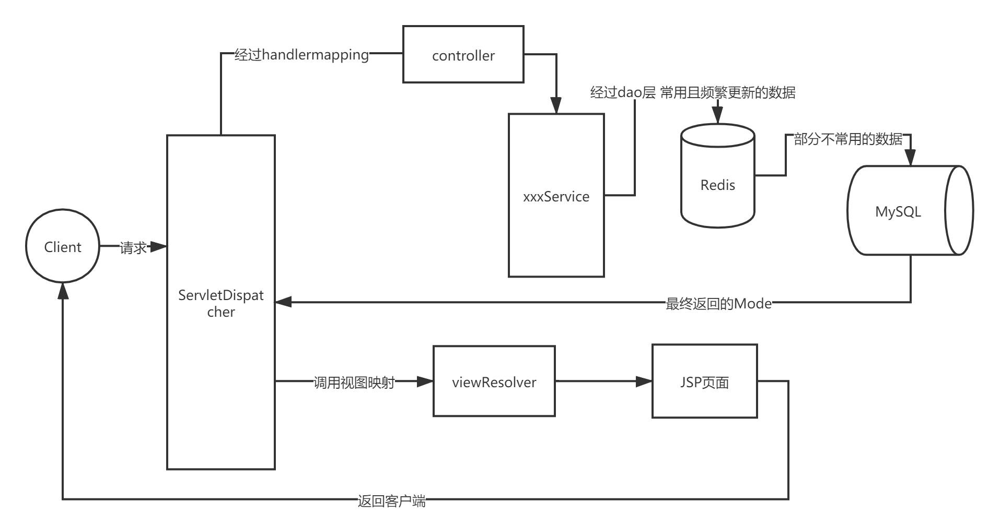

# voteSystem项目简介

## 实现什么目标?

​	一个投票系统,类似于QQ群投票的一个web版本
​	系统两类人 一类管理员,创建活动 管理活动信息和评委  给评委设置投票权限
​	一类是评委  对相应的项目进行投票
​	可能存在某一个时刻,并发访问量特别大的情况,比如某文艺比赛的晋级现场 需要全场观众现场投票

## 需要哪些功能?

​	核心:创建活动功能 投票功能
​	辅助功能:  登录功能 展示功能  邮箱验证功能等

## 用到哪些技术?

-   前端
    		html+css+JS+bootstrap框架搭建页面骨架
    		ajax传送json负责前后端数据流动
    		jquery实现对表单页面的操纵
-   中间层
    		MVC三层架构,  沿用SpringMVC的架构
-   后端数据库
    		redis
    			存储项目信息,评委信息包含在项目信息中,总之,存储使用频率高的信息
    		MySQL
    			存储管理员信息,每个管理员账号下的项目信息,通过项目名与号码与redis中一一对应
    			总之 存储使用频率不那么高的,但是安全性要求相对较高的信息
-   服务器端搭建
    		服务器软件tomcat,项目构建maven,版本控制git,部署docker